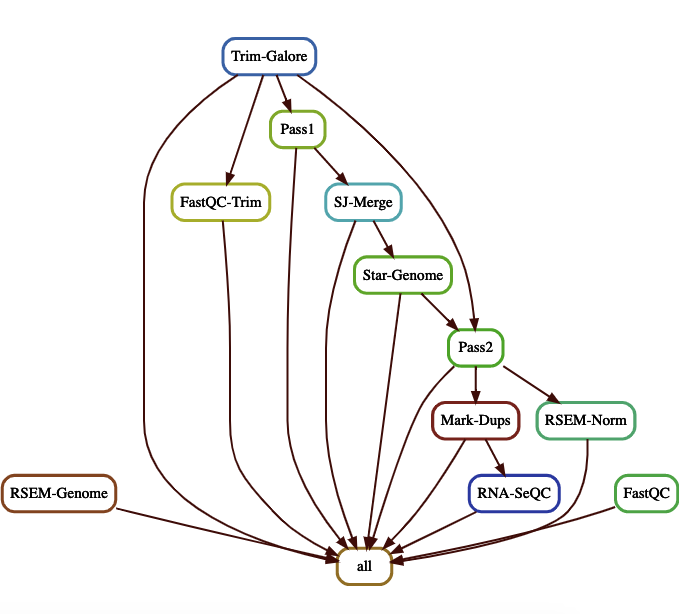

# RNA-Seq-Flow

 RNA-Seq Flow is the script written in python snakemake format which starts from the raw fastq files and ends all the way to give you gene and Isoform level count using RSEM, to Increase the mapping effeciency, it does 2nd pass STAR Allignment by indexing the genome again  using the  merged SJ.0UT.tab files from the 1st pass. for the quality control it does Fastqc as well as does trimming though Trim-Galore.

    

## Required Tools  

 * [FastQC](https://www.bioinformatics.babraham.ac.uk/projects/fastqc/) (A quality control tool for high throughput sequence data)

 * [Trim-galore](https://www.bioinformatics.babraham.ac.uk/projects/trim_galore/) (Automates quality  control and adapter trimming of fastq files)

 * [STAR](https://github.com/alexdobin/STAR) (Spliced aware ultrafast transcript alligner to refernece genome)

 * [Picard](https://broadinstitute.github.io/picard/) (Cammand line set  tool to manipulate high-throughput sequencing data)

 * [RNA-SeQC](https://software.broadinstitute.org/cancer/cga/rna-seqc) (Qualiy Control metrices of RNA-Seq data)

 * [RSEM](https://github.com/deweylab/RSEM) (Accurate quantification of gene and isoform expression levels from RNA-Seq data)


## Setting up conda environment for tools and their dependencies 

* Install [anaconda](https://docs.anaconda.com/anaconda/install/) or load it if it's already on your server

* conda create --name rnaseq-env

* source activate rnaseq-env

* conda install -c bioconda star

* conda install -c bioconda fastqc

* conda install -c bioconda rsem

#### Use STAR to index the genome for 1st pass allignment, the 2nd pass allignemnt uses the new index from merged SJ.out.tab files from the  script
```
 STAR  --runMode genomeGenerate --runThreadN 24 --genomeDir ./ --genomeFastaFiles hg38.fa   --sjdbGTFfile gencode.v30.annotation.gtf 
```
#### To Generate a combined fastqc report for all the samples (.txt) 
```
 python3 fastqc-summary -s $INDIR > "QC_Report.txt"
```
#### To quantify the gene expression levels and compatibility with RNA-SeQC, the gencode GTF needs to be collapsed using the `GTex` script [collapse_annotation.py](https://github.com/broadinstitute/gtex-pipeline/blob/master/gene_model/collapse_annotation.py)
```python
python3 collapse_annotation.py gencode.v30.annotation.gtf  gencode.v30.GRCh38.genes.gtf
```
#### To Run the pipeline on cluster using this command 'modify cluster.json  parameters according to your cluster configuration 
```
snakemake -j 999 --configfile config.yaml --use-conda --nolock --cluster-config cluster.json --cluster "sbatch -A {cluster.account} -p {cluster.partition}  -N {cluster.N} -n {cluster.n}  -t {cluster.time} --mem {cluster.mem}"
```